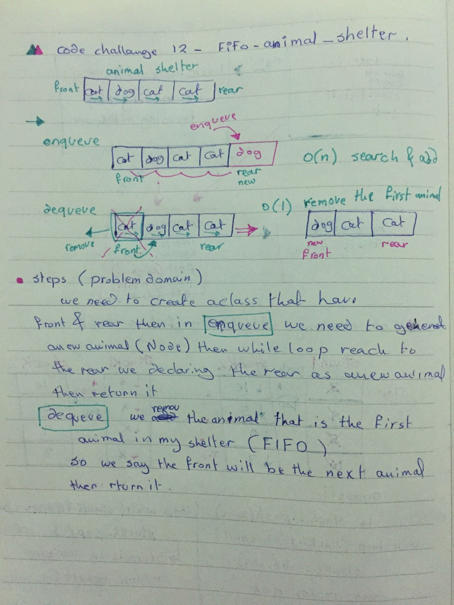
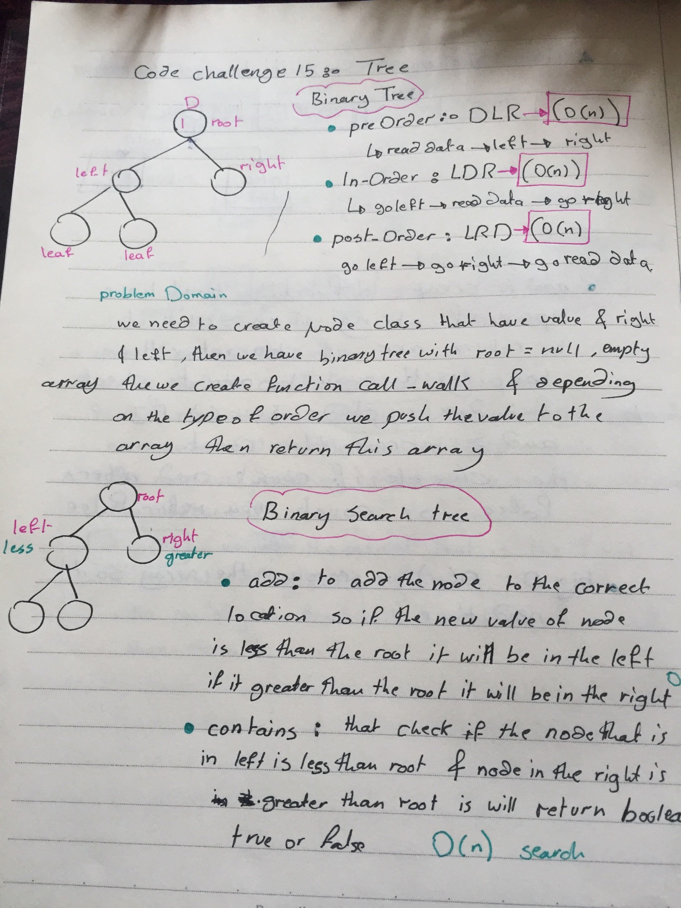
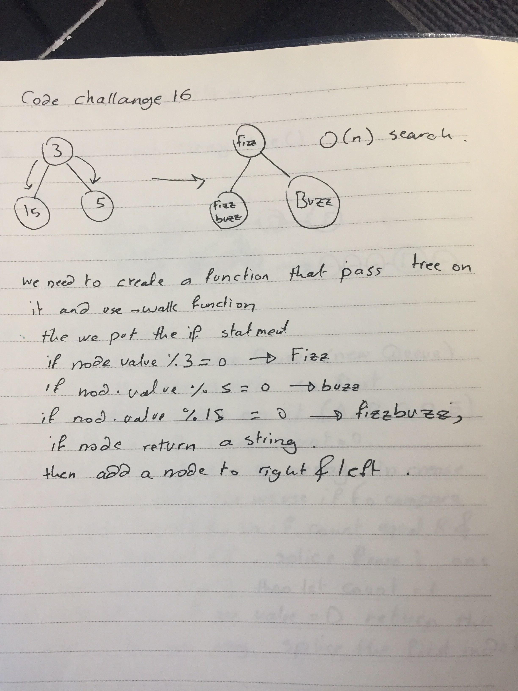
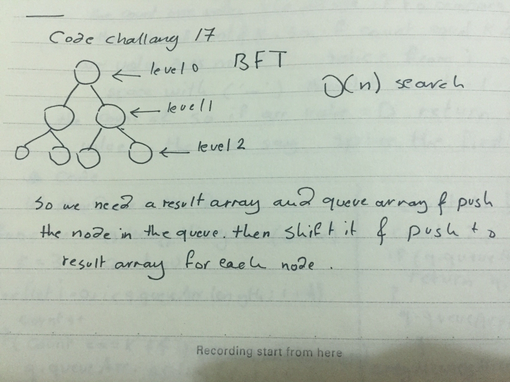
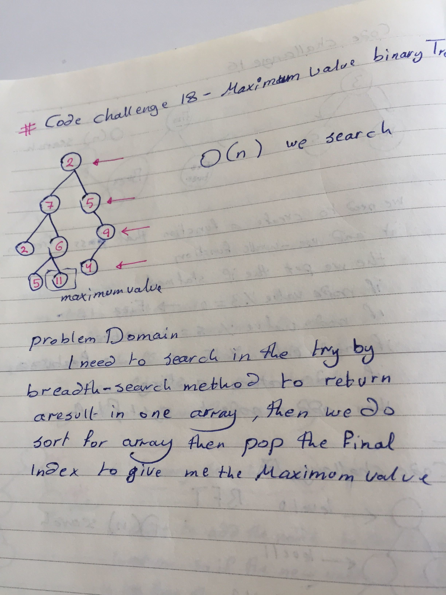
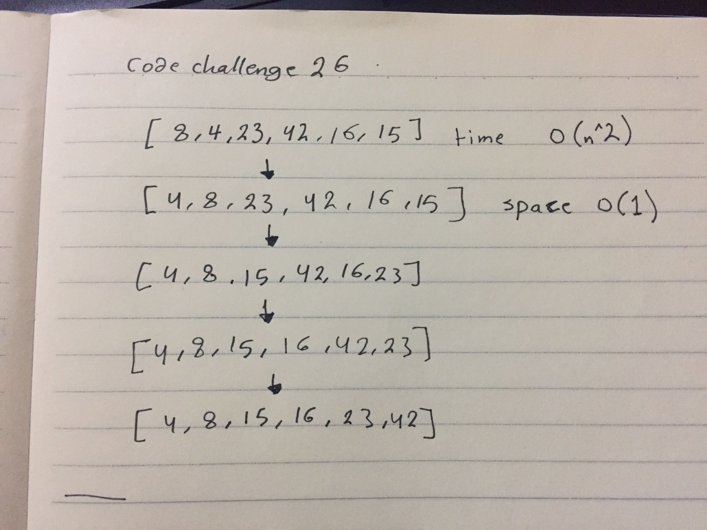

# data-structures-and-algorithms

* Action : [https://github.com/asharoran-401-advanced-javascript/data-structures-and-algorithms/actions]
## Code Challange 2 - Shift-Array
* (pull Request): [https://github.com/asharoran-401-advanced-javascript/data-structures-and-algorithms/pull/3]
* (white board): ] 

==============================================================================================
## Code challange 3 - Binary Array

* (pull Request): [https://github.com/asharoran-401-advanced-javascript/data-structures-and-algorithms/pull/2]
* (white board): ] 
========================================================================

## Code Challage 4 - Interviews

*  (pull Request): [https://github.com/asharoran-401-advanced-javascript/data-structures-and-algorithms/pull/4]
* (white board): ] 
* (white board): ] 
=====================================================================
## Code challange 5 - linked list
 * (pull Request): [https://github.com/asharoran-401-advanced-javascript/data-structures-and-algorithms/pull/5]
 * (white board): ] 

================================= 
## Code Challenge 6 - Linked list insertions.

* (pull-request):[https://github.com/asharoran-401-advanced-javascript/data-structures-and-algorithms/pull/6]
* (white board): ] 

=====================================
## Code Challange 7 - LinkedList k-th value from the end of a linked list.

* (pull-request) : [https://github.com/asharoran-401-advanced-javascript/data-structures-and-algorithms/pull/7]
* (white board) : 
 

================================================================

## Code Challange 8 - Merge two linked lists.

* (pull Request): [https://github.com/asharoran-401-advanced-javascript/data-structures-and-algorithms/pull/8]
* (whiteBoard) :  

======================================================================

## Code Challange 10 - Stacks and Queues.
* (pull Request): [https://github.com/asharoran-401-advanced-javascript/data-structures-and-algorithms/pull/13]
* (whiteBoard) :

================================================================

## Code Challange 11 - Implement a Queue using two Stacks.
* (pull Request) : [https://github.com/asharoran-401-advanced-javascript/data-structures-and-algorithms/pull/14]
* (whiteBoard) : [https://github.com/asharoran-401-advanced-javascript/data-structures-and-algorithms/blob/master/assets/queue-by-twoStack.jpg]

================================================

## Code Challange 12 - First-in, First out Animal Shelter.

* (pull Request) : [https://github.com/asharoran-401-advanced-javascript/data-structures-and-algorithms/pull/16]
* (whiteBoard) : 

=======
======================================================

## Code Challange 13 - Multi-bracket Validation.
* (pull Request): [https://github.com/asharoran-401-advanced-javascript/data-structures-and-algorithms/pull/18]
* (white Board): 

========================================================
## Code Challange 15 - Tree 
* (pull Request) : [https://github.com/asharoran-401-advanced-javascript/data-structures-and-algorithms/pull/19]
* (White Board) : 
=======
## Code challange 16 - FizzBuzz Tree 

* (pull request) : [https://github.com/asharoran-401-advanced-javascript/data-structures-and-algorithms/pull/20]
* (white Board) : 

============================================

## Code Challange 17 -  breadth first traversal 

* (pull request) : [https://github.com/asharoran-401-advanced-javascript/data-structures-and-algorithms/pull/21]
* (white Board) : 

==================================================================

## Code Challenge 18 - find-maximum-binary-tree

* (pull request) : [https://github.com/asharoran-401-advanced-javascript/data-structures-and-algorithms/pull/22]
* (white Board) : 

===================================================================

## Code Challenge 26 - Insertion Sort
* (pull request): [https://github.com/asharoran-401-advanced-javascript/data-structures-and-algorithms/pull/24]
* (white Board): 

===================================================================

## Code Challenge 27 - Merge Sort

* (pull request): []
* (white Board): 