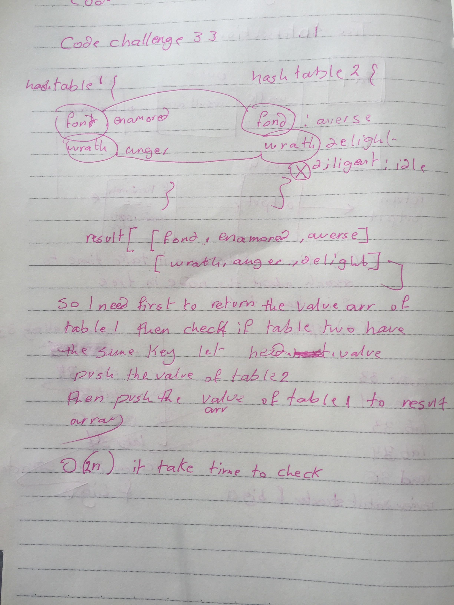

# Hashmap LEFT JOIN
<!-- Short summary or background information -->

## Challenge
Write a function that LEFT JOINs two hashmaps into a single data structure.
The first parameter is a hashmap that has word strings as keys, and a synonym of the key as values.
The second parameter is a hashmap that has word strings as keys, and antonyms of the key as values.
Combine the key and corresponding values (if they exist) into a new data structure according to LEFT JOIN logic.
LEFT JOIN means all the values in the first hashmap are returned, and if values exist in the “right” hashmap, they are appended to the result row. If no values exist in the right hashmap, then some flavor of NULL should be appended to the result row.

## Approach & Efficiency
leftJoin - 0(n) 
for time o(a , b) --> O(2n)becaue here we have two table and i need to check for value on it 
for space also it O(n) 
in array O(1) --> because we push the similar value to the array it take O(1) to return result

## Solution
leftJoin(mapA, mapB) - Takes in two hashmaps and returns values in first hashmap and if values exist in the right they are appended to the results.

