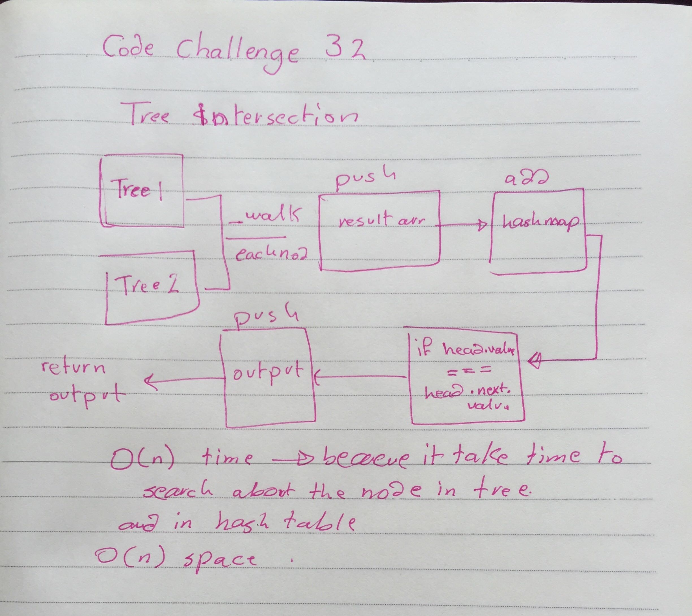

# Tree Intersection Challenge

Find common values in 2 binary trees.

## Challenge

Write a function called treeIntersection that takes in two binary tree parameters and returns all of the matching values.

## Approach & Efficiency
* `treeIntersection` - 0(a , b) because we have two diffrent tree O(2n)
* `_walk`_ - O(n) because we search and check each node so it's take time 

## API
* `intersectionTree(treeOne , treeTwo)` - Takes in two binary trees and outputs any matching values.
then add it to hash table and check the value then push it in the output arr  
* `__walk` - Takes node and check if it have a left and right node then push the value to result arr

## Solution

